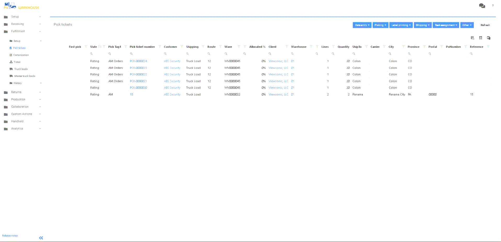

# Agrupación

En la pantalla de Pedidos de Venta, podrá aplicar etiquetas a los pedidos. Añadiendo etiquetas podrá clasificar y agrupar más fácilmente los pedidos que necesite procesar. Vea el vídeo adjunto.


Download video demonstration

