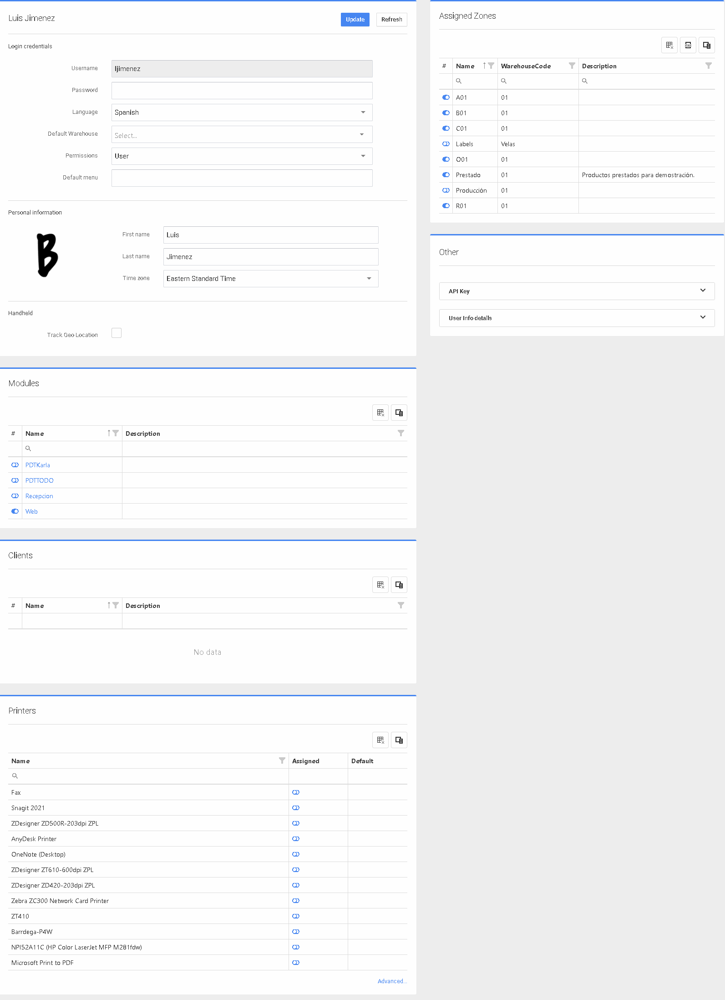
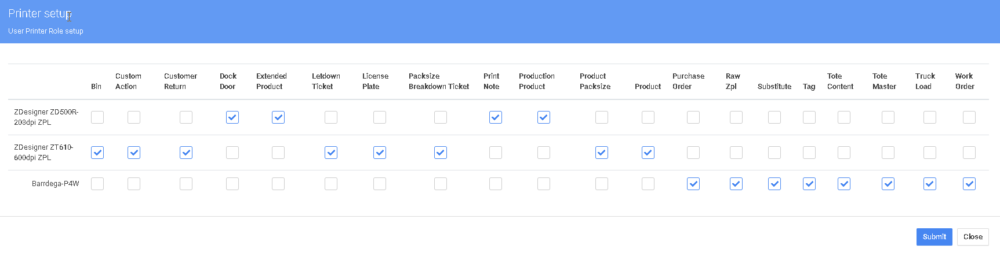

# Crear usuarios

Para crear un nuevo usuario, vaya a Configuración > Sistema > Usuarios

El menú Usuarios muestra las distintas cuentas de usuario creadas. Como se mencionó en la sección anterior, las cuentas de usuario pueden ser de tipo Administrador y de tipo Usuario. Se pueden crear nuevos usuarios seleccionando el botón "Nuevo" de la parte superior derecha o se pueden eliminar los usuarios existentes seleccionando la "X" negra situada a la derecha de cada usuario de la lista (las nuevas cuentas de Administrador adicionales se pueden eliminar, pero no la cuenta de Administrador inicial). Para examinar o editar un usuario existente, simplemente seleccione el nombre de usuario de la lista.

.png>)

.png>)

Desde la lista de usuarios del Almacén P4 puede realizar varias tareas:

* Añadir nuevo usuario
* Activar un usuario desactivado
* Desactivar un usuario
* Eliminar un usuario

Además, puede suplantar (haga clic en el icono de enlace de la foto de abajo) a un usuario para verificar los permisos y ayudar en la disposición de las pantallas.

.png>)

En la pantalla Lista de usuarios, puede abrir y editar un usuario existente haciendo clic en el enlace de la columna de usuarios o puede hacer clic en el botón NUEVO para añadir un nuevo usuario.

En la Pantalla de Configuración de Usuario hay varias secciones importantes que deben ser configuradas. Credenciales de inicio de sesión - En esta sección de la pantalla configurará los ajustes básicos para el usuario, como el nombre de usuario, la contraseña, el idioma, el Almacén predeterminado y los permisos básicos. Zonas asignadas - En esta área configure las zonas en las que el usuario puede trabajar. Esto se utiliza para evitar que los usuarios trabajen fuera del almacén o zona asignada. Información Personal - Nombre, Apellidos y Zona Horaria y foto del usuario. Handheld - Esta configuración sólo se debe utilizar para los vehículos propiedad de la empresa que están haciendo las entregas de la empresa. Módulos - Aquí es donde se configuran los permisos basados en el rol de los usuarios en el almacén.

**Clientes** - Esta configuración es para un usuario que trabaja para un 3PL específico. Esta configuración limitará al usuario a ver sólo los clientes, proveedores, órdenes de venta, órdenes de compra de un cliente 3PL.

**Impresoras** - En esta sección usted elegirá la(s) impresora(s) que el usuario está autorizado a utilizar. Después de seleccionar la(s) impresora(s) adecuada(s) seleccione una impresión como predeterminada. En la esquina inferior derecha, hay un botón Avanzado. Haga clic en este botón para asignar diferentes impresoras a diferentes etiquetas.

**Menú por defecto** - Determina la pantalla que se muestra al iniciar sesión, por ejemplo /demolatam/main/pickTicketList/true abrirá la pantalla de pedidos pendientes para el Demolatam Inquilino.


Utilícelo con precaución, ¡¡¡poner datos no válidos aquí puede bloquear al usuario del sistema!!!


