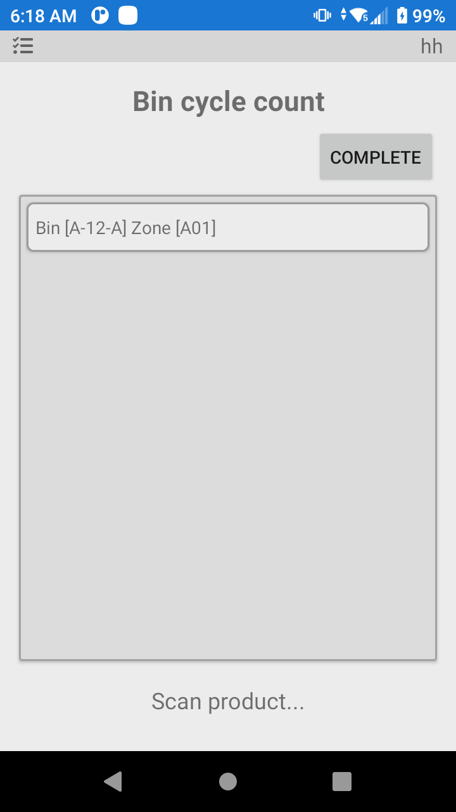
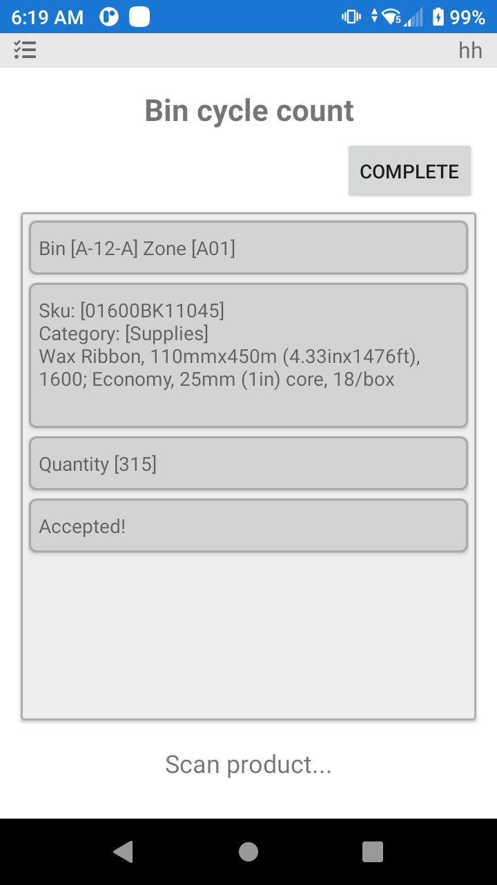
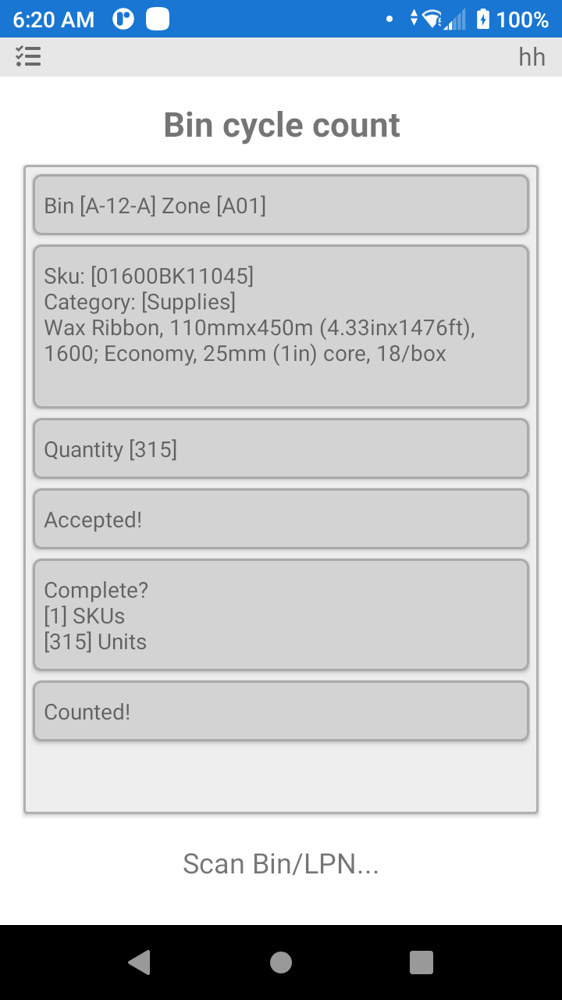

# Conteo Cíclico

La opción de recuento cíclico es para el proceso de recuento del inventario físicamente dentro del almacén (ubicaciones). Las razones típicas para el recuento cíclico son obtener un recuento preciso del inventario en una ubicación o en todo el almacén. Con el tiempo, el inventario real del almacén puede no coincidir con el contabilizado en el software P4 Warehouse (debido a roturas, robos, etc.). Por lo tanto, un recuento cíclico contabiliza con precisión el inventario físico. El recuento cíclico incluye un campo de opción para la papelera en la parte superior y una sección de registro en la parte inferior.

.png>)

