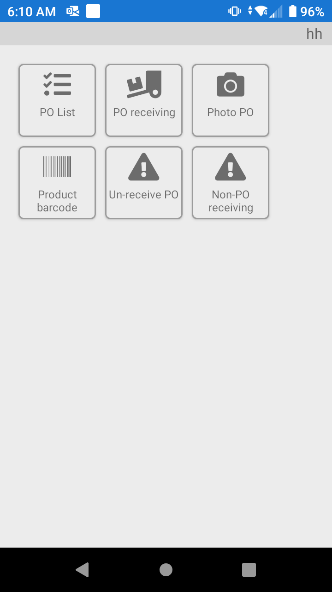

# Información general sobre la recepción

* Recepción - El icono de recepción contiene todas las funciones para la recepción de productos.
* Lista de pedidos para un almacén de tipo ecommerce para seleccionar de una lista de pedidos de compra abiertos.
* Recepción de pedidos para permitir la recepción de pedidos de compra.
* PO Foto para documentar el producto dañado en la recepción.
* Código de barras del producto para imprimir los códigos de barras que faltan para los productos.
* Des-recibir Orden de Compra permite des-recibir el producto si es ingresado incorrectamente. (El Pedido de Compra debe estar en estado Abierto para este proceso).
* La Recepción sin Orden de Compra permite al usuario recibir un producto que no está en la Orden de Compra específica. (Debe haber una orden de compra para el proveedor, esto no es para recibir al azar cualquier cosa que llegue a la puerta del almacén).

