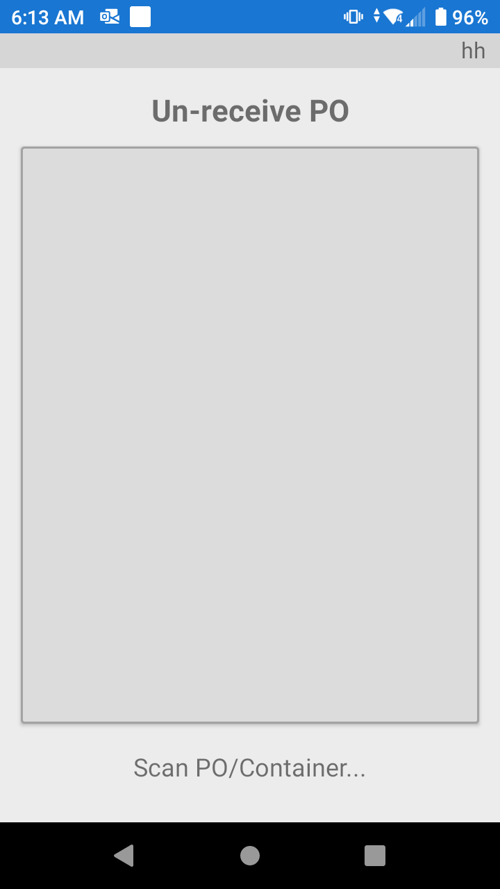

# Anular la recepción de un pedido

En caso de que un producto se reciba de forma incorrecta y no se haya cerrado la Orden de Compra, existe la posibilidad de anular la recepción del/de los producto(s).


Recuerde que el proceso de recepción es absolutamente el más importante de un almacén. Las malas prácticas de recepción provocarán muchos retrasos en otros procesos del almacén.


