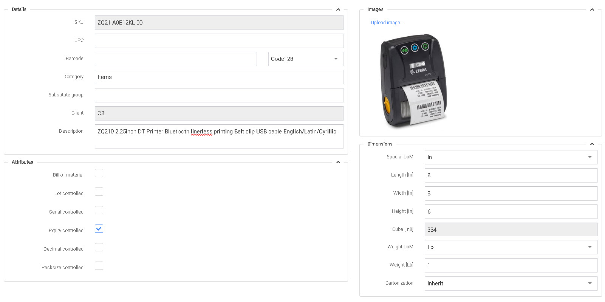

# Expiración Producto

P4 Warehouse está diseñado para que la gestión de productos con caducidad sea una tarea sencilla. En la creación de un nuevo producto basta con seleccionar el atributo Caducidad Controlada en la pantalla de configuración del producto.


La configuración de los atributos debe seleccionarse antes de realizar cualquier transacción para este producto en el sistema.


