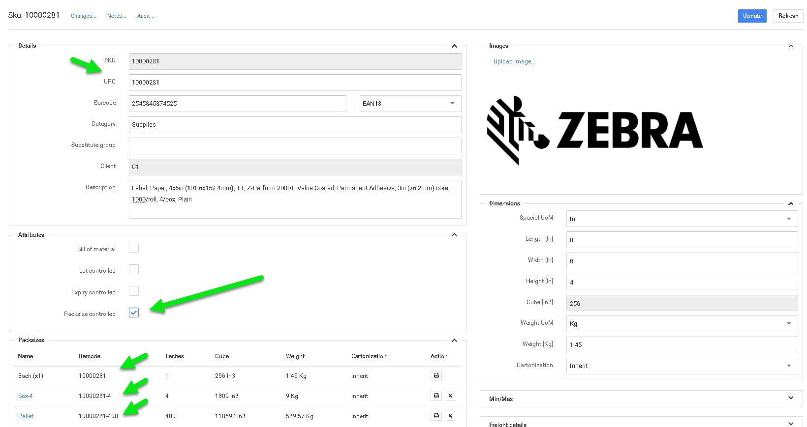

# Tamaño de paquete

La configuración y gestión del tamaño de los paquetes es una función de potencia!.

P4 Warehouse puede tener un número ilimitado de tamaños de envase por producto. Cada tamaño de paquete debe estar identificado por un código de barras único. Si cada tamaño de envase tiene un código de barras único, P4 Warehouse no le preguntará qué tamaño de envase está procesando, el software simplemente le pedirá la cantidad de envases.


Por ejemplo, si tengo un producto configurado con los siguientes tamaños de envase, cada uno, envase interior, envase exterior, tamaño de envase de palé, y recibo un contenedor con 20 palés, escanearía el código de barras del palé y recibiría 20 palés en una sola operación.


Una vez que el producto está en el almacén, puede vender el producto en cualquier tamaño de embalaje, ya que el software le pedirá que divida la cantidad de palés en cualquier tamaño de embalaje inferior (palés en cajas, por ejemplo). Como se muestra en la foto, cada paquete tiene un código de barras único.


Los productos serializados sólo pueden gestionarse por unidades.


