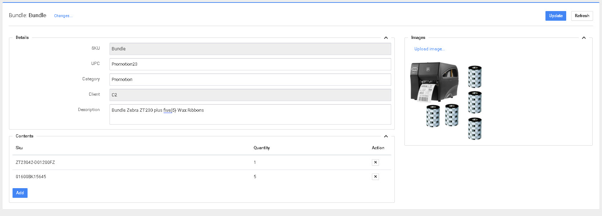

# Paquetes de Productos

P4 Warehouse permite crear paquetes de productos. Un ejemplo de paquete de productos sería una promoción de ventas de "compre una Impresora Térmica y llévese 5 rollos de cintas incluidos". En el proceso de pedido, el vendedor simplemente ingresa el SKU de la promoción en el sistema de pedidos. En ese momento, el SGA entiende que necesita recolectar varios productos y cantidades para completar el pedido. Esto reduce la posibilidad de que el vendedor cometa un error de digitación.


Los subcomponentes deben crearse antes de poder crear el Paquete de Productos.


En la imagen anterior, P4 Warehouse enviará a un recolector a recoger 1 impresora y cinco (5) rollos de cinta de cera para completar el pedido. Las dos (2) líneas podrían ingresarse manualmente en la orden de venta, pero la función de Paquete de Productos reduce la posibilidad de error. Si utiliza SAP B1, esto se denomina kit de ventas.&#x20;


Recuerde que un paquete de productos y la producción son dos (2) procesos diferentes.&#x20;

La producción es cuando se convierten uno (1) o más productos en un SKU completamente nuevo.


### Paquete de Productos vs. BOM (Lista de Materiales)

| Paquete de Productos | BOM (Lista de Materiales) |
|----------------|-------------------------|
| **Propósito:** Despacho/recolección | **Propósito:** Producción/manufactura |
| **Comportamiento:** Se desglosa en líneas de recolección por componente | **Comportamiento:** Consume componentes, crea producto terminado |
| **Inventario:** Se rastrea solo a nivel de componente | **Inventario:** Se consumen componentes, se crea inventario del nuevo SKU |
| **Boleta de Despacho:** Muestra componentes individuales | **Orden de Trabajo:** Muestra componentes a ensamblar |
| **Ejemplo:** Impresora + 5 cintas en promoción | **Ejemplo:** Ensamblar materias primas en producto terminado |
| **Caso de Uso:** Kits de venta, sets de regalo, paquetes promocionales | **Caso de Uso:** Manufactura, ensamblaje, producción de kits |

---

## Descripción General

La función de Paquete de Productos de P4 permite definir paquetes de múltiples componentes como SKUs vendibles individuales. Un SKU de paquete en la orden → P4 lo desglosa automáticamente en cada línea de recolección de componente individual. Los recolectores nunca ven el SKU del paquete, solo los componentes exactos a recolectar. Esto elimina errores manuales y asegura envíos completos en todo momento.

La funcionalidad de paquetes está incluida de forma estándar sin cargos adicionales de licencia.

---

## Funcionalidad Principal

**Desglose Automático** — Los SKUs de paquete generan líneas de recolección separadas para cada componente en tiempo real a medida que llegan las órdenes, sin necesidad de intervención manual.

**Rastreo a Nivel de Componente** — El inventario se rastrea únicamente a nivel de componente. El SKU del paquete no tiene saldo de stock — funciona puramente como una instrucción de despacho.

**Prevención de Envíos Parciales** — P4 valida que todos los componentes estén disponibles en cantidad suficiente antes de liberar las órdenes. Si algún componente falta, toda la orden del paquete se retiene.


Un envío parcial no es posible — el sistema impide liberar un paquete incompleto. Si cualquier componente individual no está disponible, toda la orden del paquete se retendrá hasta que haya stock disponible.


**Aislamiento por Cliente** — En entornos 3PL, las definiciones de paquetes de cada cliente permanecen completamente independientes, evitando confusiones entre cuentas.

---

## Capacidades Clave

- Desglose automático de boletas de despacho
- Definiciones de paquetes por cliente
- Gestión de inventario a nivel de componente
- Prevención de envíos parciales
- Funcionalidad de importación/exportación masiva
- Integración con oleadas y recolección por lotes
- Flujos de trabajo de recolección con escáner RF

---

## Pasos de Configuración

### Crear un Paquete de Productos

1. Navegue a **Setup → Products → Product Bundles**
2. Haga clic en **Create New Bundle**
3. Ingrese el **SKU del Paquete** (el SKU vendible que los clientes ordenarán)
4. Agregue cada componente:
   - Seleccione el **SKU del Componente** de su lista de productos
   - Ingrese la **Cantidad** requerida por paquete
   - Repita para todos los componentes
5. **Guarde** la definición del paquete


Los componentes deben existir previamente como productos en P4 Warehouse antes de poder agregarlos a un paquete.


### Importación Masiva por Hoja de Cálculo

Para crear o actualizar muchos paquetes a la vez:

1. Navegue a **Setup → Products → Product Bundles**
2. Haga clic en **Import** (o **Bulk Upload**)
3. Descargue la plantilla de hoja de cálculo
4. Complete las definiciones de sus paquetes:
   - Columna A: SKU del Paquete
   - Columna B: SKU del Componente
   - Columna C: Cantidad por paquete
   - Repita filas para cada componente en cada paquete
5. Suba la hoja de cálculo completada
6. P4 valida y crea/actualiza todas las definiciones de paquetes

**Ejemplo de Plantilla:**

| Bundle SKU | Component SKU | Quantity |
|------------|---------------|----------|
| PROMO-PRINTER-01 | PRINTER-ZD421 | 1 |
| PROMO-PRINTER-01 | RIBBON-WAX-4X6 | 5 |
| DINING-SET-OAK | TABLE-TOP-OAK | 1 |
| DINING-SET-OAK | TABLE-BASE-01 | 1 |
| DINING-SET-OAK | CHAIR-OAK-BLK | 4 |

### Editar o Desactivar Paquetes

- Para **editar**: Abra la definición del paquete, modifique las cantidades de componentes o agregue/elimine componentes, y guarde.
- Para **desactivar**: Elimine todos los componentes o marque el SKU del paquete como inactivo. Las órdenes existentes se completarán, pero las nuevas órdenes no podrán usar el paquete.

---

## Flujo de Trabajo en Cuatro Pasos

1. **Definir el paquete** — Navegue a **Setup → Products → Product Bundles** y cree la definición del paquete (manualmente o por carga de hoja de cálculo).
2. **Llega la orden** — Una orden de cliente con el SKU del paquete llega por EDI, comercio electrónico o ingreso manual.
3. **Desglose automático** — P4 desglosa el paquete en líneas de recolección de componentes individuales y valida la disponibilidad de todos los componentes.
4. **Despacho** — Los recolectores completan las líneas de componentes; los paquetes completos se envían sin envíos parciales.

---

## Aplicaciones Reales

| Caso de Uso | Ejemplo |
|---|---|
| Sets de muebles | Paquete de comedor (base de mesa, tapa de mesa y cuatro sillas) |
| Kits de electrónicos | Base de carga con cables y accesorios |
| Paquetes de regalo / promocionales | Sets de cuidado de la piel por temporada |
| Paquetes variados de alimentos | Surtidos de snacks |

---

## Mejores Prácticas

**Use SKUs de paquete descriptivos** — Elija SKUs de paquete que indiquen claramente que son paquetes (por ejemplo, prefijos `PROMO-`, `KIT-`, `BUNDLE-`) para evitar confusión con productos regulares.

**Valide la disponibilidad de componentes regularmente** — Ejecute reportes de inventario sobre los componentes de paquetes para identificar posibles agotamientos antes de que bloqueen órdenes.

**Documente los paquetes de temporada** — Si crea paquetes promocionales para temporadas o campañas específicas, incluya el nombre de la campaña o rango de fechas en el SKU o descripción para fácil identificación y limpieza.

**Pruebe antes de salir en vivo** — Cree un paquete de prueba con componentes de bajo valor y ejecute un ciclo completo de orden (crear orden → asignar → recolectar → enviar) para verificar el flujo antes de implementar en producción.

**Monitoree las retenciones por envíos parciales** — Configure alertas o reportes diarios para identificar órdenes de paquetes retenidas por escasez de componentes, para que los gerentes de almacén prioricen el reabastecimiento.

**Coordine con ventas y mercadeo** — Asegúrese de que su equipo de ventas y sistema de comercio electrónico utilicen los SKUs de paquete correctos. Un error de digitación en el sistema de ingreso de órdenes puede causar que el desglose del paquete falle.

**Aproveche la importación masiva para actualizaciones** — Cuando los paquetes promocionales cambian frecuentemente (campañas de temporada, ofertas por tiempo limitado), mantenga una hoja de cálculo maestra y re-importe para actualizar las definiciones rápidamente.

---

## Preguntas Frecuentes

**¿A qué nivel se rastrea el inventario?**\
Solo a nivel de componente. Los paquetes no tienen saldo de stock separado — el SKU del paquete es una instrucción de despacho, no un artículo de inventario.

**¿Puedo importar definiciones de paquetes de forma masiva?**\
Sí. Use la opción de carga de hoja de cálculo en **Setup → Products → Product Bundles** para crear o actualizar múltiples definiciones simultáneamente.

**¿Qué sucede cuando un componente está agotado?**\
Las órdenes se retienen y marcan. Los gerentes de almacén pueden ver exactamente qué componente está bloqueando el despacho.

**¿Puede un solo componente aparecer en múltiples paquetes?**\
Sí. Un componente puede ser parte de múltiples definiciones de paquetes. P4 rastrea la demanda consolidada a través de todos los paquetes.

**¿Los paquetes funcionan con oleadas y recolección por lotes?**\
Sí. Las líneas de componentes de paquetes se integran perfectamente con las operaciones estándar de oleadas y recolección por lotes.

**Al facturar en P4 Books, ¿el cliente ve el SKU del paquete o los componentes?**\
La factura muestra el SKU del paquete (lo que el cliente ordenó). La boleta de despacho muestra los componentes (lo que el almacén recolectó). El inventario se consume a nivel de componente. Esto asegura documentos limpios para el cliente mientras se mantienen operaciones de almacén precisas.

**¿Cómo maneja P4 los componentes con múltiples tamaños de empaque?**\
El motor de asignación de P4 selecciona el tamaño de empaque óptimo para cada componente según su estrategia de recolección e inventario disponible. Por ejemplo, si un paquete requiere 4 sillas y tiene un paquete de 4 disponible, el recolector puede completarlo con una sola recolección en lugar de cuatro unidades individuales. El sistema elige automáticamente la combinación de tamaño de empaque más eficiente.

**¿Puedo usar el mismo componente en múltiples paquetes?**\
Sí. Un solo SKU de componente puede aparecer en cualquier cantidad de definiciones de paquetes. Por ejemplo, un cable de poder estándar podría estar incluido en cinco kits de electrónicos diferentes. P4 rastrea la demanda total de componentes a través de todas las órdenes de paquetes abiertas, brindándole una vista consolidada de los requerimientos de inventario.

**¿Qué sucede durante la asignación si tengo múltiples paquetes en la misma orden?**\
P4 valida todos los componentes de todos los paquetes antes de liberar la orden. Si tiene suficiente inventario para completar el Paquete A pero no el Paquete B en la misma orden, toda la orden se retiene hasta que se puedan cumplir todos los requerimientos de paquetes. Esto previene envíos parciales y asegura la integridad de la orden.

---

## Solución de Problemas

**Problema: La orden del paquete no se desglosa en líneas de componentes**

- **Causa:** El SKU del paquete puede no estar definido correctamente en Setup → Products → Product Bundles
- **Solución:** Verifique que la definición del paquete exista y tenga al menos un componente activo

**Problema: La orden está retenida con error "Component unavailable"**

- **Causa:** Uno o más componentes del paquete tienen inventario disponible insuficiente
- **Solución:** Revise la pantalla de detalle de la orden para ver qué componente(s) están cortos. Reabastezca el stock, sustituya con un componente alterno o ajuste la definición del paquete

**Problema: El recolector ve el SKU del paquete en su dispositivo en lugar de los componentes**

- **Causa:** El desglose del paquete pudo haber fallado, o la orden se creó antes de que se guardara la definición del paquete
- **Solución:** Cancele y vuelva a crear la boleta de despacho. Si el problema persiste, verifique que el paquete esté configurado correctamente y contacte a soporte

**Problema: La cantidad del componente es incorrecta en la boleta de despacho**

- **Causa:** La definición del paquete puede tener la cantidad incorrecta para ese componente, o múltiples paquetes en la misma orden se están combinando
- **Solución:** Revise la definición del paquete. Si la orden contiene múltiples unidades del paquete (por ejemplo, 3× DINING-SET-OAK), verifique que P4 multiplicó las cantidades de componentes correctamente (3 paquetes × 4 sillas = 12 sillas)

**Problema: El cliente recibió un envío de paquete incompleto**

- **Causa:** La prevención de envíos parciales puede estar deshabilitada, o los componentes se recolectaron por separado y no se validaron como un set completo
- **Solución:** Habilite la prevención de envíos parciales en System Configuration → Fulfillment. Revise su proceso de envío para asegurar que los componentes del paquete se empaquen juntos y se validen antes del despacho

---

## Funciones Relacionadas

**[BOM - Lista de Materiales](bom-bill-of-materials.md)** — Módulo de producción para fabricar productos terminados a partir de materiales componentes. Diferente de los Paquetes de Productos, que son solo para despacho.

**[Tamaño de Empaque](packsize.md)** — Sistema de 5 niveles de unidad de medida de P4 que determina cómo se recolectan los componentes (unidad, empaque interno, caja, tarima, contenedor).

**[Asignación](../../exit-orders/allocation.md)** — Sistema de reserva de inventario que valida la disponibilidad de componentes antes de liberar órdenes de paquetes a recolección.

**[Oleadas](../../exit-orders/waving.md)** — Proceso de recolección por lotes que incluye líneas de componentes de paquetes junto con líneas de órdenes regulares.

**[Perfiles de Facturación 3PL](../../3rd-party-logistics/billing-profiles.md)** — Para operadores 3PL: configure definiciones de paquetes por cliente y facture la mano de obra de armado de kits como un servicio de valor agregado.

---

## Ver También

- [Página de la Función de Gestión de Paquetes de Productos](https://p4warehouse.cloud/features/product-bundles.html) (Resumen de mercadeo)
- [Crear un Producto](../../getting-started/create-a-product.md)
- [Creación de Boletas de Despacho](../../exit-orders/pick-ticket-creation/README.md)
