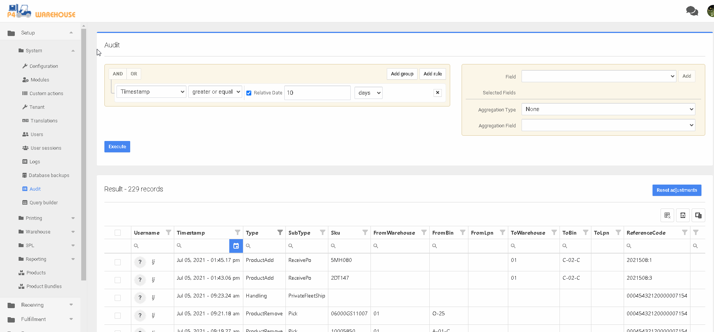

# Sistema - Auditoría

## Auditoría de su almacén

El área de auditoría permite al usuario crear auditorías personalizadas de casi cualquier función del WMS. Estos datos se utilizan para investigar errores de usuario o para verificar que un proceso se ha completado correctamente.


[system-audit.md](system-audit.md)



Al cargar la pantalla, puede hacer clic en Ejecutar para ver los datos de los últimos 10 días.


