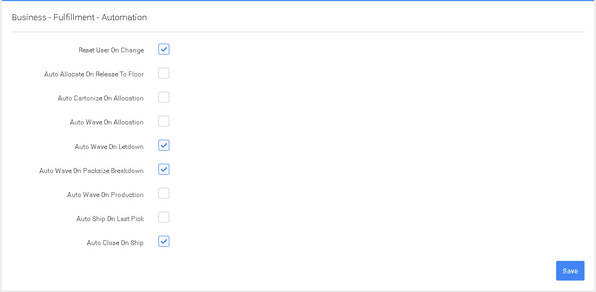

# Automatización

Configuración de la automatización

1. Restablecer Usuario en Cambio - Esta configuración es para restablecer el usuario asignado en una orden cuando el estado de la orden cambia de ser recogida a clasificada. Esto permite al despachador asignar la orden a una persona de envío.
2. Auto Asignar al Liberar al piso - Esto se utiliza en operaciones más pequeñas y/o almacenes de comercio electrónico donde usted tiene una abundancia de inventario y quiere que los pedidos se envíen a medida que llegan los pedidos. Esto hará que el pedido se asigne automáticamente.
3. Auto Estuchado en la Asignación - Esta configuración pone la orden en un formato estuchado, esto se utiliza sólo cuando se está utilizando la funcionalidad de estuchado de P4 Warehouse.
4. Permitir ola en Asignación - Esto se utiliza en operaciones más pequeñas y/o almacenes de comercio electrónico donde usted tiene una abundancia de inventario y quiere que el pedido se envíe a medida que llegan los pedidos. esto hará que la etiqueta de selección se imprima automáticamente.
5. Onda automática en bajada - Esto imprimirá automáticamente la etiqueta de recogida una vez que se hayan completado las bajadas de producto.
6. Desglose del tamaño del paquete de onda automática - Este ajuste hará que la etiqueta de selección se imprima automáticamente una vez completado el desglose del tamaño del paquete.
7. Onda automática en producción -Esto hará que una orden de producción imprima automáticamente la etiqueta de selección de producción en caso de que se requiera una orden de producción para llenar una orden de venta, o se ingrese una orden de producción manual.
8. Envío automático en la última selección - Esto hará que el pedido se envíe automáticamente en la última recogida, lo que evitará el proceso de envío.
9. Cierre automático al enviar - Esto hará que el pedido de cliente pase a un estado cerrado una vez finalizado el proceso de envío.


Para las líneas 8 y 9, esto se anula en caso de que haya seleccionado en el pedido de venta el recuento en el envío, el recuento en la entrega, la firma en el envío o la firma en la entrega.


