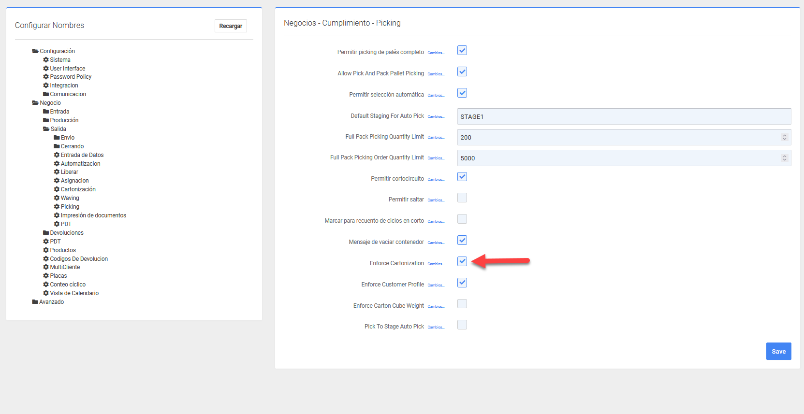
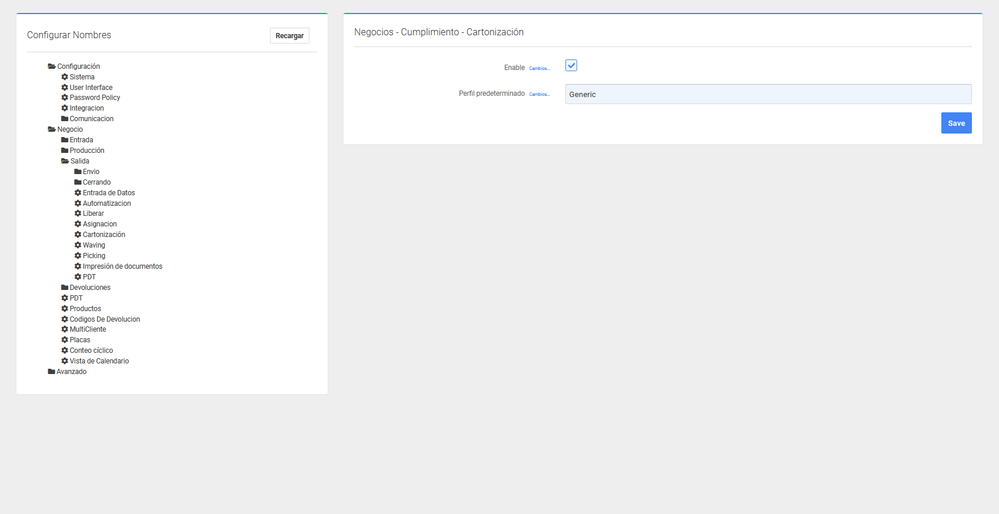

# Cartonización

En esta sección se configuran los parámetros para la **cartonización** dentro de P4 Warehouse.\
La cartonización es el proceso mediante el cual el sistema determina el tipo y cantidad de cajas que se utilizarán para empacar un pedido.

En la pantalla mostrada a continuación, se encuentra la opción Enforce Cartonization (Aplicar cartonización).

<figure><figcaption></figcaption></figure>

Cuando esta casilla está marcada, el sistema condiciona a que todos los pedidos se procesen aplicando el perfil de cartonización definido, evitando que se salten estas reglas durante el cumplimiento.

<figure><figcaption></figcaption></figure>

Enable (Habilitar): Activa o desactiva el uso de cartonización en los procesos de cumplimiento.

Perfil predeterminado: Selecciona el perfil de cartonización que se utilizará por defecto en las operaciones.

Guarda los cambios realizados en la configuración.

> Es recomendable que antes de activar esta función se definan correctamente los perfiles de cartonización en el sistema.
