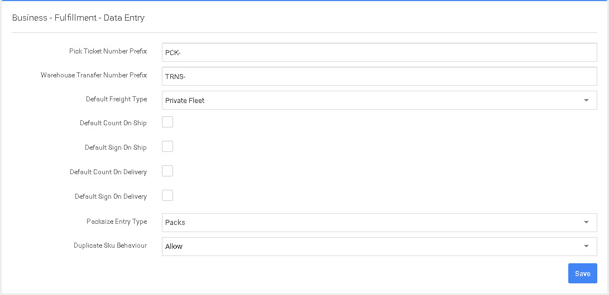

# Entrada de datos

En esta pantalla configurará los valores por defecto de la Entrada de Datos.

1. Prefijo del número de ticket de picking - Este es el prefijo que aparecerá delante de los números de pedido de venta. (PCK-0001).
2. Prefijo del número de transferencia al almacén - Este es el prefijo que aparecerá delante de los números de las órdenes de transferencia. (TRNS-0001).
3. Tipo de carga por defecto - Este será el tipo de carga por defecto. Si usted envía mayormente FedEx o UPS aquí seleccionaría Paquete Pequeño. Este es el valor predeterminado, sin embargo, a nivel de la orden puede seleccionar el método de envío correcto.
4. Recuento por defecto al enviar - Se trata de requerir un nuevo recuento del producto antes de completar el proceso de envío.
5. Firma por defecto en el barco - Esto hará que el pedido requiera una firma en el envío y permitirá capturar una foto del producto antes del envío.&#x20;
6. Por defecto Contar en la entrega - Esto requerirá que el conductor de la entrega vuelva a contar cada palet o caja en la entrega.&#x20;
7. Firma en la entrega por defecto - Esto requerirá que el conductor de la entrega requiera una firma del cliente en la entrega. Además, se puede capturar una foto en el proceso de entrega.&#x20;
8. El tipo de entrada de tamaño de paquete es Paquetes o unidades, esto determina la etiqueta predeterminada para imprimir según el tipo de almacén que opere.
9. Valor de SKU duplicado - Determina si se permite duplicar sku's en un pedido. A menudo se establece en «Prevenir» para reducir la posibilidad de doble entrada de datos. Esto es extremadamente útil cuando se introducen pedidos grandes.
