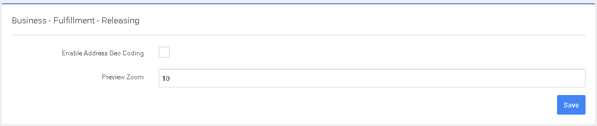

# Liberación

Esta pantalla permitirá configurar los ajustes de Liberación. 

1. Habilitar Geo Codificación de Dirección - Si una dirección debe ser validada y Geo Codificada al ser liberada al piso - No funciona con consolidación TruckLoad. Nota, la dirección puede cambiar después de la geocodificación. Nota, Pueden aplicarse costes adicionales.
2. Zoom de Vista Previa - El nivel en el que se puede hacer zoom en la dirección(mapa).

