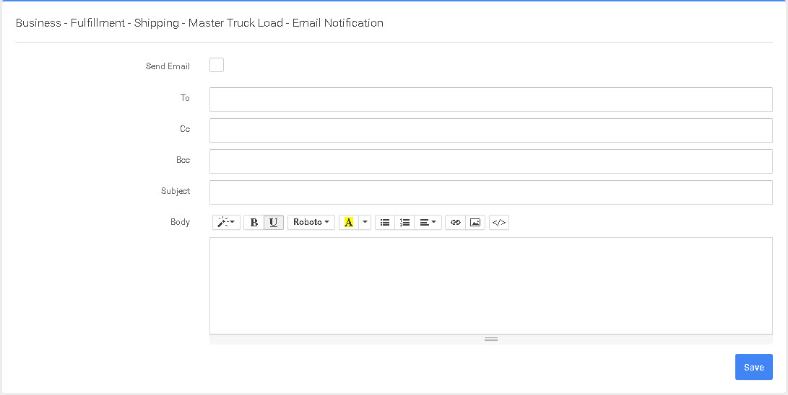

# Correo electrónico

En esta pantalla configurará el correo electrónico que se enviará al cliente, al empleado interno o al proveedor 3PL.


Al entrar en esta pantalla y mantener el ratón sobre los campos, verá que hay una serie de campos predefinidos que puede incluir en la plantilla de correo electrónico.

