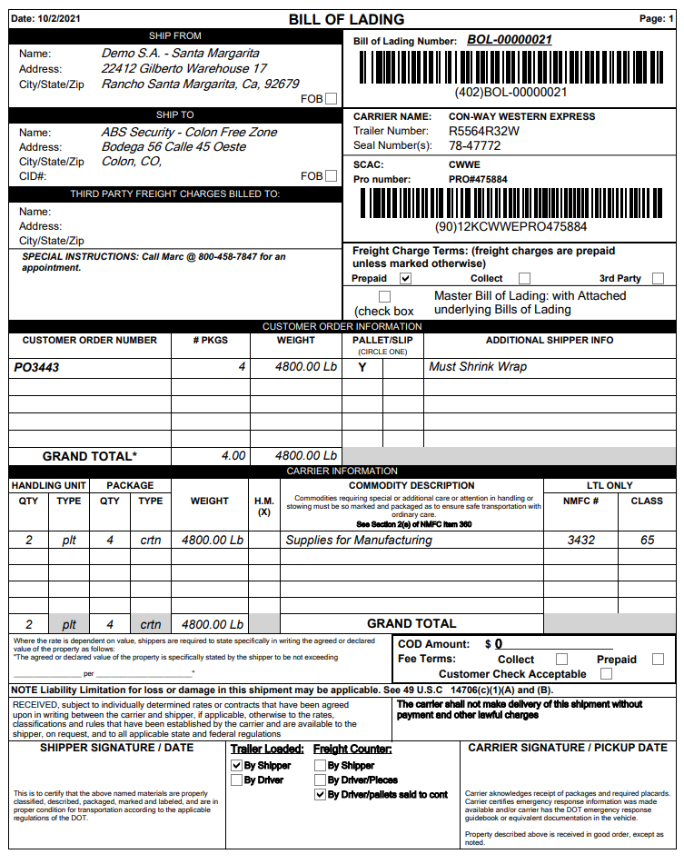

# Camión de carga

<figure><figcaption></figcaption></figure>

<figure><figcaption></figcaption></figure>

En la pantalla de arriba verá que hay cuatro pedidos diferentes embarcando en el mismo trailer, toda la información requerida sobre la carga es capturada en la pantalla de Carga del Camión.&#x20;

Estos datos se utilizan para crear el Conocimiento de Embarque. Los pedidos pueden añadirse a un conocimiento de embarque de uno en uno o en bloque, dependiendo de sus procesos.&#x20;

Una vez que la pantalla de Carga de Camión esté configurada en Etapa, el botón BOL estará disponible.&#x20;

Las firmas se capturan en el PDT entrando en la pantalla de envío del Camión de Carga.
