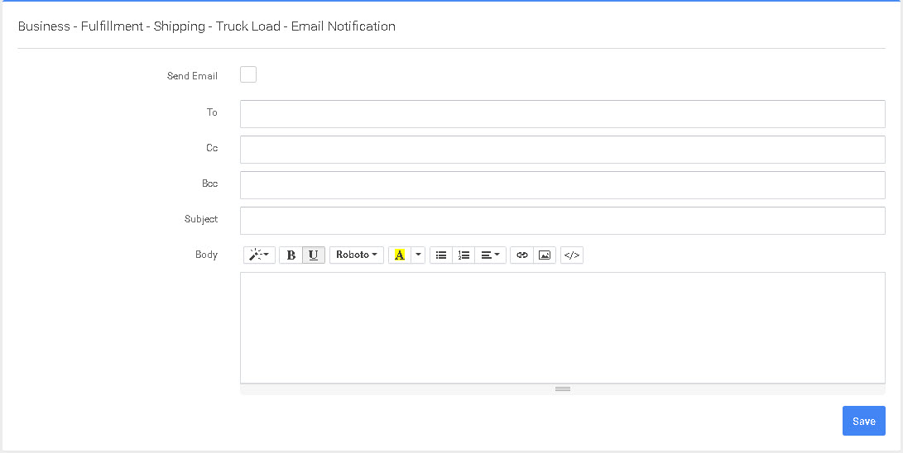

# Correo electrónico

En esta pantalla podrá configurar el correo electrónico que se enviará cuando se envíe el pedido.


Al entrar en esta pantalla y mantener el ratón sobre los campos, verá que hay una serie de campos predefinidos que puede incluir en la plantilla de correo electrónico.


