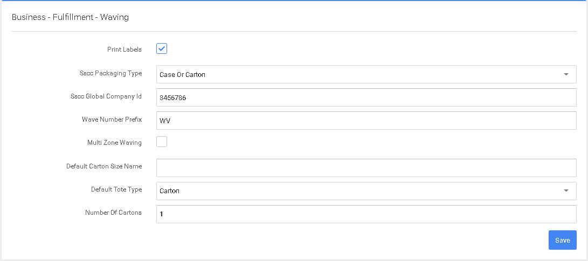

# Onda

Esta página de configuración incluye el Tipo de Embalaje SSCC (las opciones son Caja o Cartón, Palé, Uso Intraempresa o Indefinido), el ID Global de la Empresa SSCC, el Prefijo del Número de Onda (por defecto: WV), la Ondulación Multizona (casilla de verificación), el Número de Cartones (por defecto: 1) y el Número de Copias (por defecto: 1).&#x20;

Tras modificar cualquier entrada, seleccione el botón «Guardar» situado en la parte inferior derecha.


Si un pedido es «Un-Waved», pasará a un estado «Unallocated» (Allocating reserva stock en el almacén específicamente para su ticket de picking. Sin asignar significa que no se reservará inventario para pedidos de recogida como parte de esa ola).


