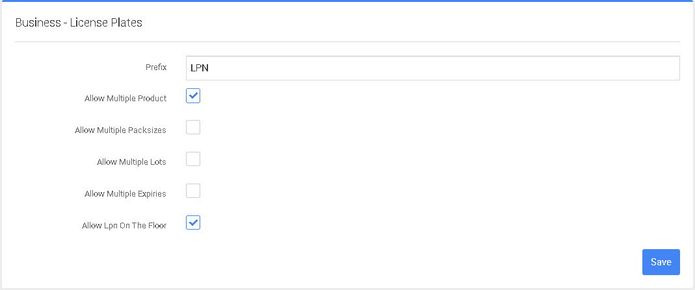

# License Plates - LPN

Esta página de configuración incluye Prefijo de matrícula (prefijo por defecto: LPN), Permitir varios productos (activada/desactivada, por defecto: activada), Permitir varios tamaños de paquete (activada/desactivada, por defecto: desactivada), Permitir varios lotes (activada/desactivada, por defecto: desactivada) y Permitir varios vencimientos (activada/desactivada, por defecto: desactivada). Después de modificar cualquier entrada, seleccione el botón "Guardar" en la parte inferior derecha.

1. Prefijo: El prefijo es el dato que aparece antes del número LNP, por ejemplo LPN0001.
2. Permitir varios productos - Este ajuste controla si se permiten varias SKU en el mismo LPN.
3. Permitir varios tamaños de paquetes - Este ajuste controla si se permiten varios tamaños de paquetes en un único LPN.
4. Permitir varios lotes: esta opción controla si se permiten varios números de lote en un único LPN.
5. Permitir múltiples fechas de caducidad: esta opción controla si se permiten múltiples fechas de caducidad en un único LPN.
6. Permitir LPN en el piso - Esta configuración controla si se requiere una ubicación de contenedor para un LPN o si el LPN puede simplemente estar en el piso.


Recuerda hacer clic en Guardar antes de salir de la pantalla para guardar la configuración.

