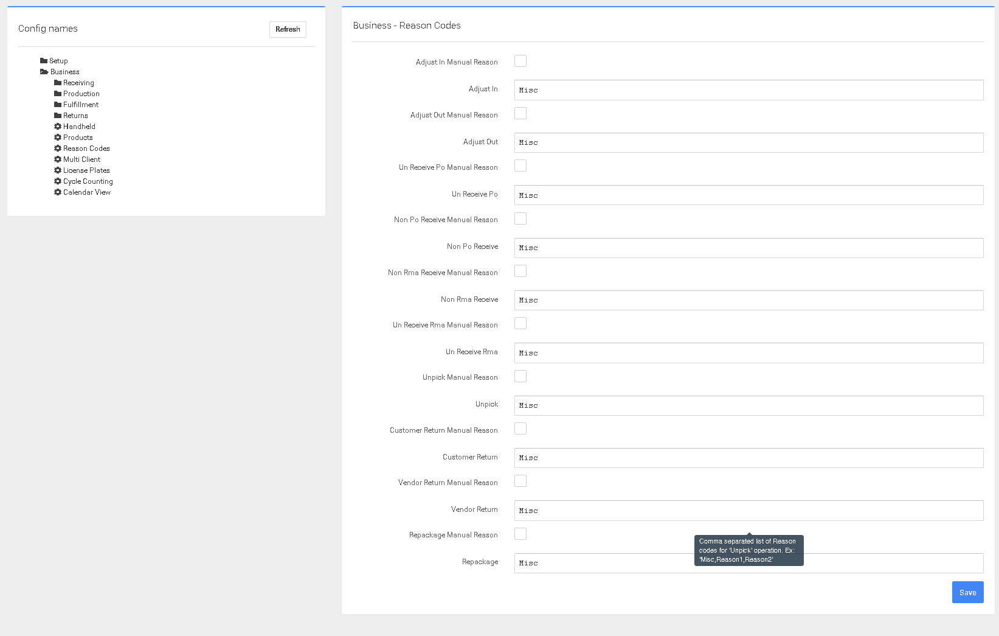

# Códigos de devolución

Los Códigos de Razón son para diferentes tipos de ajustes. Al configurar los códigos de devolución, es importante incluir las diferentes situaciones que se darán en su almacén.


Los Códigos de Razón le permitirán rastrear las diferentes razones por las que se ajusta el inventario, lo que le permitirá desarrollar un plan para resolver las razones.



Es especialmente importante que los códigos de devolución estén configurados para permitir el seguimiento de los motivos por los que se realizan ajustes. Todos los ajustes afectan a los resultados de una empresa.

