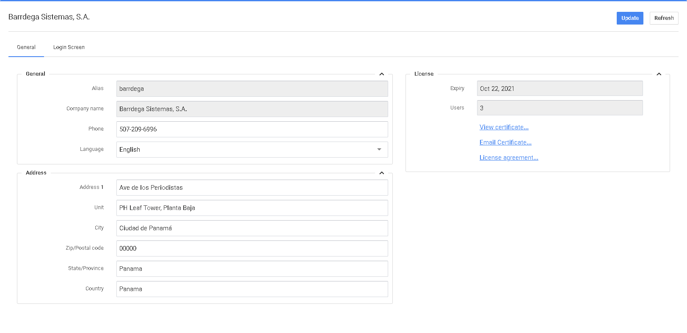
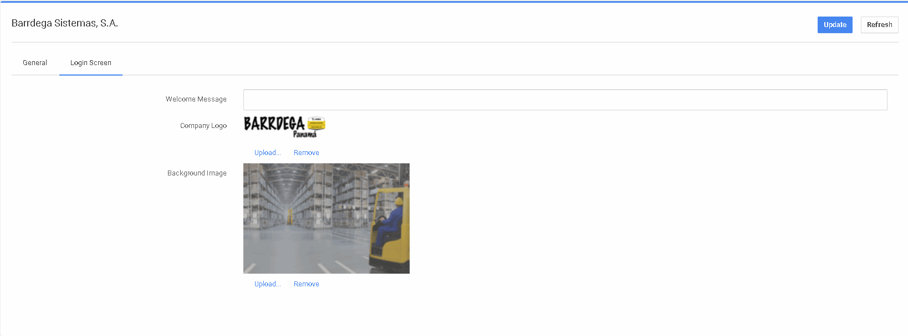

# Configuración del arrendatario

La página de Configuración del Arrendatario ofrece numerosas opciones para introducir la información de su propia empresa para el software del Sistema de Gestión de Almacenes. Hay dos pestañas para las distintas opciones: General y Pantalla de inicio de sesión.


Haga siempre clic en Actualizar para guardar sus datos cuando haya un botón de actualización visible.


En la parte derecha de esta pantalla, puede ver su recuento de licencias, leer el acuerdo de licencia o enviar por correo electrónico el certificado de licencia.

El certificado de licencia tiene un código QR que puede escanearse para validar que la licencia es válida y no ha sido modificada.


Complete todos los datos o sus Packslips y Etiquetas tendrán datos faltantes.

