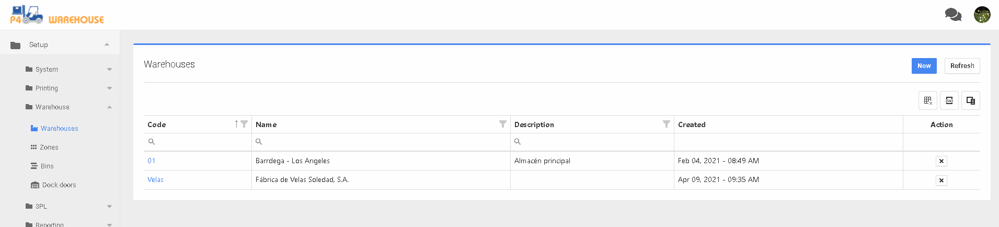

# Almacenes

[Configuración de almacén](#user-content-fn-1)[^1]


Recuerde que si P4W está integrado con un ERP, los códigos de almacén deben coincidir con el ERP.


Configuración > Sistema > Almacén

Dentro de la pantalla Almacenes, pulse el botón para crear un nuevo almacén o pulse el hipervínculo de código de almacén para añadir información detallada del almacén.&#x20;

Añada un nuevo almacén introduciendo el código del almacén, el nombre del almacén y, si es necesario, la descripción.

[^1]: 
